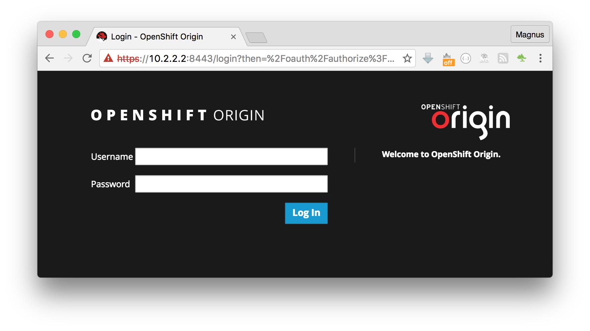
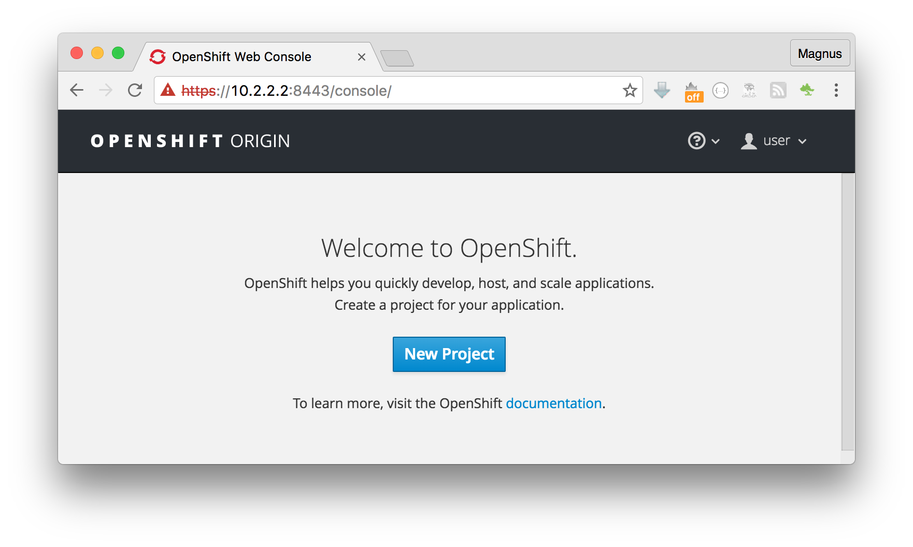
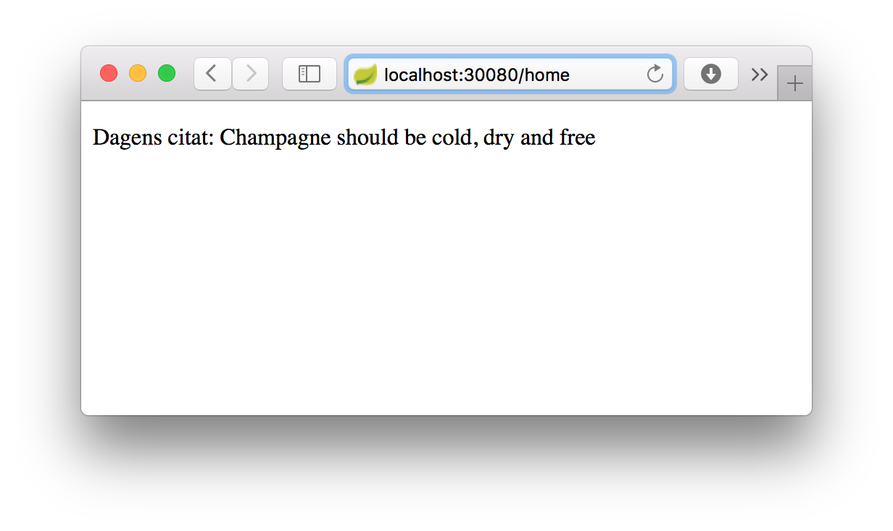
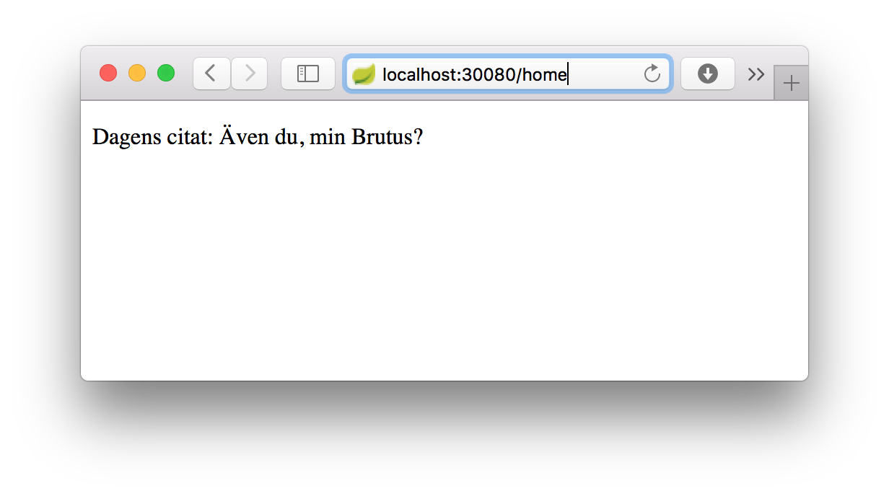
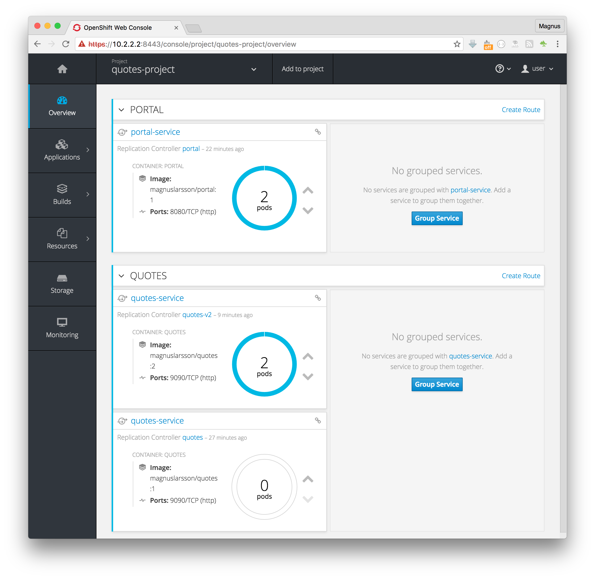

# Getting started with OpenShift Origin v1.3 in a Vagrant box

This tutorial shows how you can get started with [OpenShift Origin v1.3](https://www.openshift.org) in a Vagrant box.  The tutorial tries to use the native Kubernetes CLI, `kubectl`, as much as possible. When required the OpenShift CLI, `oc`, is used.

The tutorial is based on a [Kubernetes tutorial](https://github.com/callistaenterprise/k8s-tutorial), where a backend service, `quotes`, serves a frontend web app, `portal`, with quotes in different languages. 

To simplify this tutorial the Docker images for both `quotes` and `portal` have already been created and pushed to DockerHub, see [quotes](https://hub.docker.com/r/magnuslarsson/quotes/) and [portal](https://hub.docker.com/r/magnuslarsson/portal/)  on DockerHub.

The tutorial will go through how to:

1. Install OpenShift in a Vagrant box
1. Create a project in OpenShift
1. Deploy the backend and frontend
1. Perform a rolling upgrade of the backend to fix a bug, i.e. without noticable interruption in the frontend.

**Note:** The tutorial has been developed on a Mac but it should work fine on a Windows PC as well. Some Unix/Linux commands needs to be modified or a Linux Bash shell can be used on Windows, see [Run Bash on Ubuntu on Windows](https://blogs.windows.com/buildingapps/2016/03/30/run-bash-on-ubuntu-on-windows/#QaaXUuFgR5pe5rhL.97) for an introduction.

## Required tools

The following tools needs to be installed:

1. [Vagrant](https://www.vagrantup.com/downloads.html). I'm using v1.8.1.  
	I have got into problems with both older and newer versions so be careful with what Vagrant version you are using!
1. [VirtualBox](https://www.virtualbox.org/wiki/Downloads). I'm using v5.0.24.  
   I have seen warnings regarding that v5.1 does not work with Vagrant yet.
1. [OpenShift CLI, `oc`](https://github.com/openshift/origin/releases/tag/v1.3.0).  
   See downloads for v1.3.0 in the bottom of the page
1. [Kubernetes CLI, `kubeCtl`](https://coreos.com/kubernetes/docs/latest/configure-kubectl.html#download-the-kubectl-executable)  
	**Note:** The Windows version of `kubectl` can be found at [here](https://storage.googleapis.com/kubernetes-release/release/v1.3.6/bin/windows/amd64/kubectl.exe)
1. [Git](https://git-scm.com/book/en/v2/Getting-Started-Installing-Git).  
   Will be used to get the Kubernetes configuration files used in the tutorial

## Create an OpenShift box in Vagrant

[comment]: # (**NOTE**: Use Vagrant version 1.8.1)
[comment]: # ( ) 
[comment]: # (* Vagrant versions <=1.8.0 have issues with version number specified in the openshift boxes)
[comment]: # (* Vagrant versions >=1.8.4 - 1.8.6)

Initiate the Vagrant box in an empty folder:

	mkdir tutorial
	cd tutorial
	vagrant init openshift/origin-all-in-one

Edit the file created, `Vagrantfile`:

Add the lines below after the line:

	config.vm.box = "openshift/origin-all-in-one"

1. Specify the version of the box we want to use by adding the line:

		config.vm.box_version = "1.3.0"
	
2. Add two lines forwarding the ports that the application will expose:

		config.vm.network :forwarded_port, guest: 30080, host: 30080
		config.vm.network :forwarded_port, guest: 30090, host: 30090

Now, download and create the box with the command:  

	vagrant up

This will takes some time, go and grab a cup of coffe :-)

In the end the following should be printed out:

	==> default: Successfully started and provisioned VM with 2 cores and 5 G of memory.
	==> default: To modify the number of cores and/or available memory modify your local Vagrantfile
	==> default: You can now access the OpenShift console on: https://10.2.2.2:8443/console
	==> default:
	==> default: Configured users are (<username>/<password>):
	==> default: admin/admin
	==> default: user/user
	==> default: But, you can also use any username and password combination you would like to create
	==> default: a new user.
	==> default:
	==> default: You can find links to the client libraries here: https://www.openshift.org/vm
	==> default: If you have the oc client library on your host, you can also login from your host.
	==> default:
	==> default: To use OpenShift CLI, run:
	==> default: $ oc login https://10.2.2.2:8443

## Web Console

Open the URL [https://10.2.2.2:8443/console/](https://10.2.2.2:8443/console/) in a Web Browser.  
(I'm experience certificete problems with Safari so I use Firefox or Chrome instead)

You can login with user/user:

...but we will not use the web console to deploy to OpenShift, instead we will use CLI commands. In the end, however, we will use the web console to see the deployed artefacts.
	
## Login and create a project

Login:

	oc login https://10.2.2.2:8443 -u user -p user

Create a project:

	oc new-project quotes-project

If you later on wants to get back to this project you can set the current project with:

	oc project quotes-project

If you need to delete the project:
	
	oc delete project quotes-project
	
## Get the configuration files for Kubernetes deploy

Clone the git repo from github:

	git clone https://github.com/callistaenterprise/openshift-tutorial.git
	
## Create a backend service based on quotes:1

[comment]: # (<strong style="color:red">TBS: Deploy the quores service with two pods:</strong>)

Use the following command to create a replication controller that ensure that we always have two `quotes` pods up and running:

	kubectl create -f openshift-tutorial/quotes/quotes-controller-v1.yaml

View the status of the pods:

	kubectl get pods
	> NAME           READY     STATUS    RESTARTS   AGE
	> quotes-9h6mb   1/1       Running   0          8s
	> quotes-k9j1a   1/1       Running   0          8s
	
When STATUS = Running, find their IP's:
	
	kubectl get pods -o name | xargs kubectl describe | grep "^Name:\|IP:"
	> Name:		quotes-tis8x
	> IP:		172.17.0.8
	> Name:		quotes-z0vt9
	> IP:		172.17.0.7

Try them out!
The pods are not exposed outside the Vagrant box so we need to acces them inside the box using SSH:
		
	vagrant ssh --command 'curl 172.17.0.7:9090/quote?language=en'	
	> {"quote":"You, too, Brutus?","language":"en"}

	vagrant ssh --command 'curl 172.17.0.8:9090/quote?language=en'	
	> {"quote":"You, too, Brutus?","language":"en"}

Create a service with a cluster global port:

	kubectl create -f openshift-tutorial/quotes/quotes-service.yaml
	> service "quotes-service" created	

[comment]: # ( )
[comment]: # (outputs:)
[comment]: # ( )
[comment]: # (	> You have exposed your service on an external port on all nodes in your)
[comment]: # (	> cluster.  If you want to expose this service to the external internet, you may)
[comment]: # (	> need to set up firewall rules for the service port(s) (tcp:30090) to serve traffic.)
[comment]: # ( )
[comment]: # (	> See http://releases.k8s.io/release-1.3/docs/user-guide/services-firewalls.md for more details.)
[comment]: # ( )
[comment]: # (or:)
[comment]: # ( )
	
Now we can use the cluster wide port to access the service:  
(using the port forwarding setup in Vagrant above)

	curl localhost:30090/quote?language=en
	> {"quote":"Champagne should be cold, dry and free","language":"en"}
	
## Create a web app base on portal:1

Create pod, controller and service for the web app:

	kubectl create -f openshift-tutorial/portal/portal-controller-v1.yaml
	kubectl create -f openshift-tutorial/portal/portal-service.yaml

Try the web app with curl or in a web browser.

With curl: 	

	curl localhost:30080/home
	> <!DOCTYPE HTML>
	> 
	> <html>
	> <head>
	>     <title>Portal Home</title>
	>     <meta http-equiv="Content-Type" content="text/html; charset=UTF-8" />
	> </head>
	> <body>
	>     
Dagens citat: To be or not to be

	> </body>
	> </html>

With a web browser [http://localhost:30080/home](http://localhost:30080/home):

## Rolling upgrade of the service to quotes:2

The deployed service have a problem, the portal ask the service for quotes in Swedish but gets them in English as seen in the examples above.

Use curl to ask for a quote in Swedish:
 	
	curl localhost:30090/quote?language=sv
	> {"quote":"You, too, Brutus?","language":"sv"}

...and you will get it in English :-(

Version 2 of the quotes service, however, fix this problem :-)

So we need to upgrade to the v2 of the quotes service!

We want to do this upgrade without any downtime, i.e. performing a *rolling upgrade* where the application is operational during the upgrade of the backend service with no noticable downtime!

To be able to verify that the rolling upgrade works, start the following script in another terminal windows (but in the same directory):

	./openshift-tutorial/scripts/get-portal-home.sh

Pay attention to how the faulty English quotes are started to partly be exchanged to Swedish and finaly only quotes in Swedish are displayed. Also note how the upgrade is performed without any interruption!

Initiate the rolling upgrade:
	
	kubectl rolling-update quotes -f openshift-tutorial/quotes/quotes-controller-v2.yaml --update-period=10s
	> Created quotes-v2
	> Scaling up quotes-v2 from 0 to 2, scaling down quotes from 2 to 0 (keep 2 pods available, don't exceed 3 pods)
	> Scaling quotes-v2 up to 1
	> Scaling quotes down to 1
	> Scaling quotes-v2 up to 2
	> Scaling quotes down to 0
	> Update succeeded. Deleting quotes
	> replicationcontroller "quotes" rolling updated to "quotes-v2"

The output from the script should look something like:

  1. First quotes only in English:
	
	    
Dagens citat: Champagne should be cold, dry and free

	    
Dagens citat: To be or not to be

	    
Dagens citat: You, too, Brutus?

  1. Next mixed quotes in both English and Swedish:

	    
Dagens citat: Att vara eller inte vara

	    
Dagens citat: To be or not to be

	    
Dagens citat: Även du, min Brutus?

	    
Dagens citat: Även du, min Brutus?

	    
Dagens citat: To be or not to be

	    
Dagens citat: Även du, min Brutus?

	    
Dagens citat: Även du, min Brutus?

	    
Dagens citat: Champagne skall vara kall, torr och gratis

	    
Dagens citat: You, too, Brutus?

  1. Finally only quotes in Swedish:

	    
Dagens citat: Även du, min Brutus?

	    
Dagens citat: Champagne skall vara kall, torr och gratis

	    
Dagens citat: Även du, min Brutus?

	    
Dagens citat: Att vara eller inte vara

Also verify in the web browser that the quotes now are in Swedish, [http://localhost:30080/home](http://localhost:30080/home):

	
In the Web Console, [https://10.2.2.2:8443/console/project/quotes-project/overview](https://10.2.2.2:8443/console/project/quotes-project/overview), we can now see the deployed application:

We are done!

**Note:** If you want to, you can delete everything you deployed in OpenShift with:

	oc delete project quotes-project

